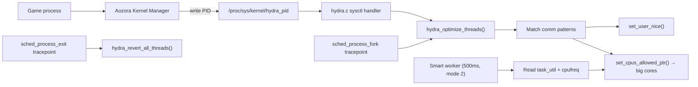

# HYDRA (High-Yield Dynamic Render Affinity)

Kernel-level game thread optimizer for Android — automatic nice boost + big core affinity for rendering threads.

## Overview
- **What it does**: Applies a nice boost (default -10) to render threads matching specific comm patterns and pins them to big cores.
- **On-demand**: Activated by writing a game PID to `/proc/sys/kernel/hydra_pid`. Zero overhead when idle.
- **Smart Mode**: Adaptive thermal-aware cpumask management.
- **Isolated**: Lives entirely in `hydra.c` and `hydra.h`, never modifying core scheduler files (`fair.c`, `core.c`, etc.).

## How It Works



When a game PID is written to `hydra_pid`, HYDRA scans the process and its threads, matching their names against known rendering thread patterns. Matched threads are boosted via `set_user_nice()` and pinned to big cores via `set_cpus_allowed_ptr()`. HYDRA hooks into scheduler tracepoints to catch newly spawned threads (`sched_process_fork`) and handle cleanup upon exit (`sched_process_exit`). A dedicated worker periodically checks task utilization and thermals to adaptively manage CPU affinity when Smart Mode is active.

## Requirements
- Android kernel source tree (msm-4.9, msm-4.14, msm-4.19, msm-5.4, or msm-5.10)
- ARM64 architecture (designed for SDM845, works on other Qualcomm SoCs with big.LITTLE)
- Root access
- `CONFIG_SCHED_HYDRA=y` in your defconfig
- Recommended: [Aozora Kernel Manager](https://github.com/xMikkkaa/Aozora-Kernel-Manager) for automated game detection

## Installation
1. Clone this repository.
2. Apply the patch to your kernel tree:
   ```bash
   cd your-kernel-tree
   git apply path/to/patches/testing/0001-sched-hydra-Introduce-High-Yield-Dynamic-Render-Affinity.patch
   ```
3. Add to your defconfig: `CONFIG_SCHED_HYDRA=y`
4. Build the kernel normally.
5. Flash the kernel.
6. Install Aozora Kernel Manager for automatic game management.

## Userspace Integration — Aozora Kernel Manager
HYDRA is designed to work seamlessly with [Aozora Kernel Manager](https://github.com/xMikkkaa/Aozora-Kernel-Manager). Aozora features a built-in Rust daemon that:
- Detects foreground game applications.
- Writes the game PID to `/proc/sys/kernel/hydra_pid`.
- Writes `0` when the game exits (the kernel also has an auto-revert via the exit hook as a fallback).
- Supports per-game profiles that map to HYDRA sysctls.

### Manual Usage
```bash
# Manual activation
echo $GAME_PID > /proc/sys/kernel/hydra_pid

# Check status
cat /proc/sys/kernel/hydra_stats

# Deactivate
echo 0 > /proc/sys/kernel/hydra_pid
```

## Tunables
HYDRA provides several sysctl interfaces to tune its behavior.

Example:
```bash
sudo sysctl -w kernel.hydra_enable=1
```

All tunables are located under `/proc/sys/kernel/`:

| Name | Default | Range | Description |
|------|---------|-------|-------------|
| `hydra_enable` | `1` | `0-1` | Global toggle. Uses static key. Off = full revert. |
| `hydra_pid` | `0` | `0` / valid PID | Target game PID. `0` = idle. Changing value reverts old + optimizes new. |
| `hydra_nice` | `-10` | `-15` to `-1` | Nice value applied to matched threads. |
| `hydra_smart_mode` | `2` | `0-2` | `0`=Off (revert, state kept), `1`=Hard Pin, `2`=Smart adaptive. |
| `hydra_throttle_freq` | `1400000` | kHz | If big core freq falls below this, it is considered throttled and the cpumask is released. |
| `hydra_heavy_util` | `300` | `0-1024` | Utilization above this pins the thread to big cores. |
| `hydra_light_util` | `100` | `0-1024` | Utilization below this restores the original cpumask. |
| `hydra_stats` | *(read-only)* | - | Shows: tracked threads, mode, throttle state, active PID, version. |

**IMPORTANT**: `hydra_light_util` must be ≤ `hydra_heavy_util`. The gap between these two values acts as a hysteresis zone where the thread maintains its current state, intentionally preventing cpumask thrashing.

## Smart Mode Explained
- **Mode 0 (Off)**: Reverts cpumask and nice values, but keeps tracking the state for when it is re-enabled.
- **Mode 1 (Hard Pin)**: Pins all matched threads to big cores unconditionally.
- **Mode 2 (Smart/Adaptive)**: A 500ms worker checks per-thread utilization and big core frequency:
  - `util > heavy_util` → pin to big cores.
  - `util < light_util` → restore original cpumask.
  - **Hysteresis zone** (between light and heavy util) → no change (prevents thrashing).
  - If big core freq < `throttle_freq` → all threads get original cpumask (thermal protection).

## Thread Matching
HYDRA searches for the following comm patterns:
- `RenderThread`, `UnityMain`, `UnityGfx`, `TaskGraph`, `GameThread`
- `adreno`, `glthread`, `kgsl`, `ANGLE`, `FrameWorker`

Matching uses `strnstr()` on the task comm. To add new patterns, edit the `hydra_comm_patterns[]` array in `hydra.h` and rebuild your kernel.

## Security
- All sysctl writes require `CAP_SYS_NICE`.
- HYDRA only modifies nice values and cpumasks — no privilege escalation is possible.
- Thread manipulation happens in workqueue context, not interrupt or probe context.
- Identity validation (using TID + start_time) prevents accidental manipulation of the wrong threads (e.g., PID recycling).

## Known Limitations
- Comm pattern matching is done at compile-time (no runtime configuration).
- Big core detection uses `capacity_orig_of()`, requiring a properly configured CPU topology.
- Maximum of 64 tracked threads per game (`HYDRA_MAX_TRACKED_THREADS`).
- Smart mode polling occurs at 500ms intervals, which is not sub-frame granularity.

## Roadmap
- Per-thread profiles (treating `RenderThread` vs `GameThread` differently).
- `uclamp` integration for frequency boosting.
- Engine auto-detection (Unity/Unreal/native).
- `debugfs`/tracepoint observability (`trace_hydra_thread_boost`).
- Runtime-configurable comm patterns via sysctl.

## License
GPL-2.0. Copyright (C) 2026 xMikkkaa.
